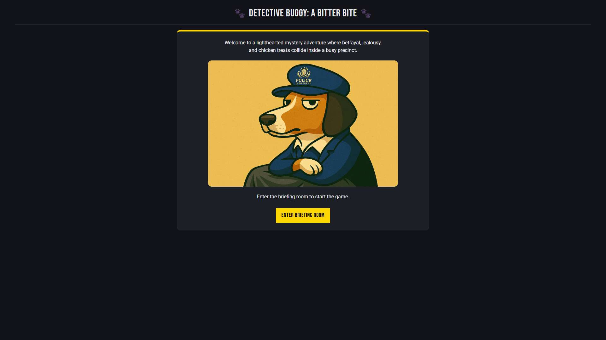
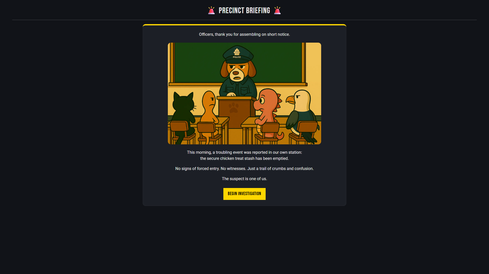
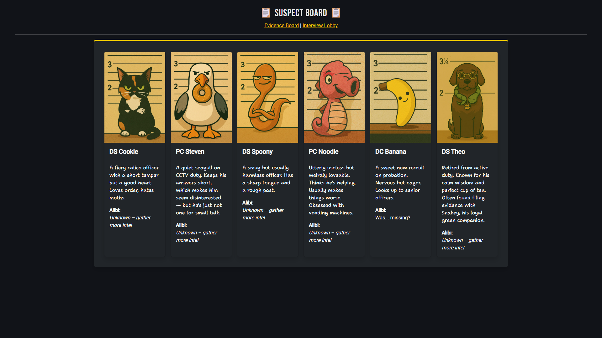

# :material-incognito: Detective Buggy - A Bitter Bite

[:material-arrow-left: Back to home](../){ .sj-back }

Detective Inspector Buggy returns to the station to find his hard-earned special chicken
treats awarded to him by the Chief Constable have gone missing. The treats were stored securely in his office. Could it really be one of the officers? It's a lighthearted, story-driven mystery game - and it was my
**CS50x final project**, as well as my first deployed full-stack app :)

P.S. BTW Buggy is actually my real-life dog and all characters (apart from one, ish) exist in real life!

---

[:material-play: Play the game](https://detective-buggy-ep1.onrender.com){ .md-button .md-button--primary }
[:material-github: Source code](https://github.com/skyejen/detective-buggy-ep1){ .md-button }
[:material-youtube: Video demo](https://youtu.be/pxXjlVCa3zw){ .md-button }

!!! note "Heads-up on load time"

    The game is hosted on a free tier that sleeps when idle, so the **first** load
    can take a minute or two to wake up. Sorry about the wait!

## :material-layers-outline: Tech stack

A Flask backend with server-side rendering, session-based game state, and a
relational database of suspects, clues, dialogue, and player analytics.

- **Python + Flask** - routing, templating, and session logic
- **Jinja2** - dynamic server-side HTML rendering
- **PostgreSQL** - stores suspects, evidence, dialogue, and playthrough analytics
- **psycopg2** with `SimpleConnectionPool` - pooled DB access for faster responses
- **Bootstrap 5 + custom CSS** - responsive, dark-themed UI
- **Render** - hosting for both the app and the database, auto-deploying on push

## :material-gamepad-variant-outline: What it does

- **Interactive suspect interviews** - each character has its own personality,
  backstory, and branching dialogue.
- **Clue-based deduction** - players unlock, track, and interpret evidence to build a case.
- **Adaptive progression** - locations and dialogue evolve based on your choices.
- **Dynamic evidence board** - clues and records update in real time as you investigate.
- **Player-driven accusations** - the endgame options appear based on what you've uncovered.
- **Private analytics dashboard** - an HTTP Basic Auth–protected `/analytics` view
  tracking total playthroughs, average playtime, and accusation accuracy (not required
  for CS50, but I'm nosey :)).

## :material-school-outline: What I got out of it

This was where a lot clicked for the first time: managing scope, balancing game logic
with storytelling, handling real user input, designing routes and endpoints, and passing
state between backend and frontend. I got properly comfortable with Git and GitHub,
learned to deploy on Render, and worked through a real **SQLite → PostgreSQL migration**.
It was terrifying to start and extremely satisfying to finish. But also I felt the curse of scope creep! (just one more dialogue... one more clue... ONE MORE SUSPECT... haha)

Things to improve at some point - cleaner session handling, less hardcoded
logic, a move to SQLAlchemy, and, of course, automated tests.

## :material-robot-happy-outline: A note on AI

Parts of this were built with help from ChatGPT - Flask routing, debugging, structure
advice, the SQLite→Postgres migration, and all of the artwork (generated from
descriptions of real pets and my dog's toys). The final logic, structure, and design
decisions are my own. I believe in being upfront about where AI helped and where the
thinking was mine.

## :material-image-multiple-outline: Screenshots

---

[:material-arrow-left: Back to home](../){ .sj-back }
